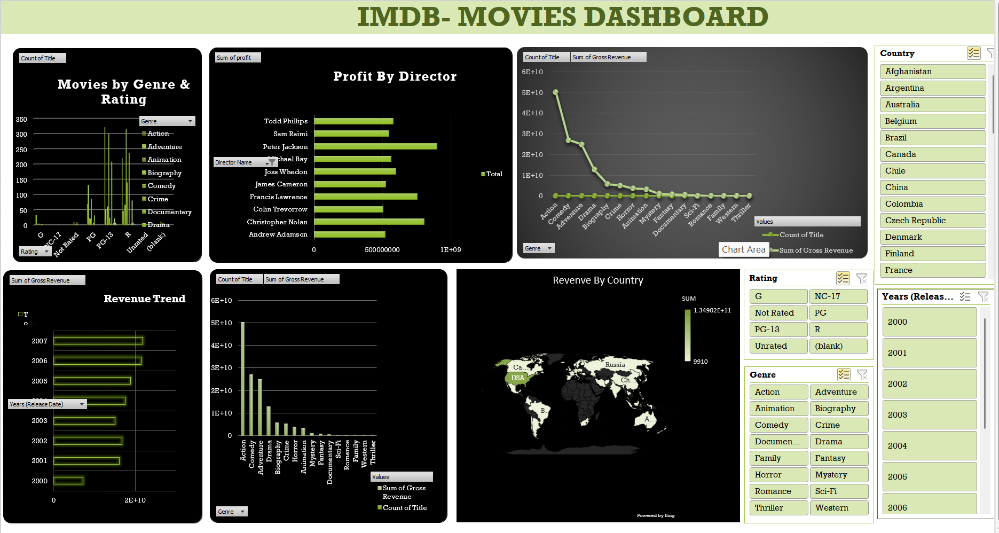

🎬 IMDB Movies Dashboard (Excel)
📌 Project Overview

The IMDB Movies Dashboard is an interactive Excel dashboard designed to analyze movie performance across different genres, ratings, directors, countries, and release years. It provides insights into movie revenue, profitability, genre popularity, and global distribution using Pivot Tables, Pivot Charts, Slicers, and Excel Dashboarding techniques.

🎯 Objectives

Analyze movie performance based on revenue and profit.

Identify top-performing directors.

Compare movie genres and ratings.

Track revenue trends over time.

Visualize revenue distribution across countries.

Enable dynamic filtering through interactive slicers.

📊 Dashboard Features

1. Movies by Genre & Rating
Displays the number of movies across different genres and ratings.
Helps identify the most common movie categories.

2. Profit by Director
Shows directors generating the highest profits.
Enables comparison of director performance.

3. Revenue by Genre
Compares total gross revenue generated by each genre.
Highlights the most profitable movie genres.

4. Revenue Trend Analysis
Tracks revenue changes across release years.
Helps identify growth and decline patterns.

5. Revenue by Country
Interactive world map showing revenue distribution by country.
Provides geographical insights into movie performance.

6. Genre Revenue Comparison
Displays both movie count and gross revenue for each genre.
Supports performance benchmarking.

🔍 Interactive Filters (Slicers)

Users can filter dashboard data by:

Country

Rating

Genre

Release Year

All charts update dynamically based on selected filters.

🛠 Tools & Excel Features Used
Microsoft Excel

Pivot Tables

Pivot Charts

Slicers

Conditional Formatting

Data Cleaning & Transformation

Map Charts

Dashboard Design & Formatting

📈 Key Insights

Adventure and Drama genres generate significant revenue.

Certain directors consistently produce highly profitable movies.

Revenue distribution varies across countries.

Movie ratings influence audience reach and revenue generation.

Release year trends reveal changes in industry performance.

📁 Project Deliverables
Interactive Excel Dashboard

Data Analysis & Visualization

Dynamic Filtering System

Revenue & Profit Insights

DASHBOARD PREVIEW

